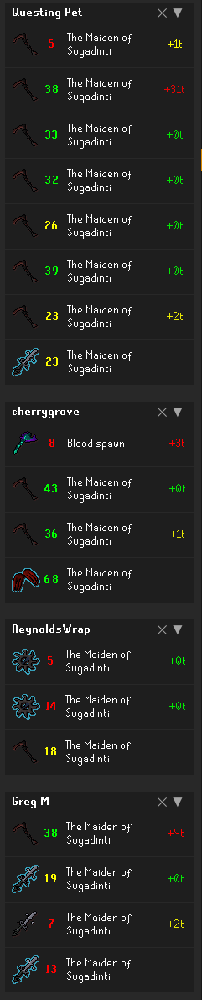

# Damage History
Tracks damage history for yourself and your party members.

## Dependencies

This plugin requires the **Customizable XP Drops** plugin from the Plugin Hub to function properly. If you don't want the customized XP drops but still want this plugin's functionality, you can uncheck "Use Customizable XP drops" from that plugin's settings.

## Known Issues

- 0 hitsplats and splashes are not currently detected and will not be shown
- Tick delays may appear incorrect when a previous hit was a miss, even though you attacked

## Changelog
### v1.1
- Fixed mage spell tick speed for manual and auto casting

### v1.0 - Initial Release
- Initial plugin release
- Track damage history for yourself and party members
- Display damage statistics in dedicated panel
